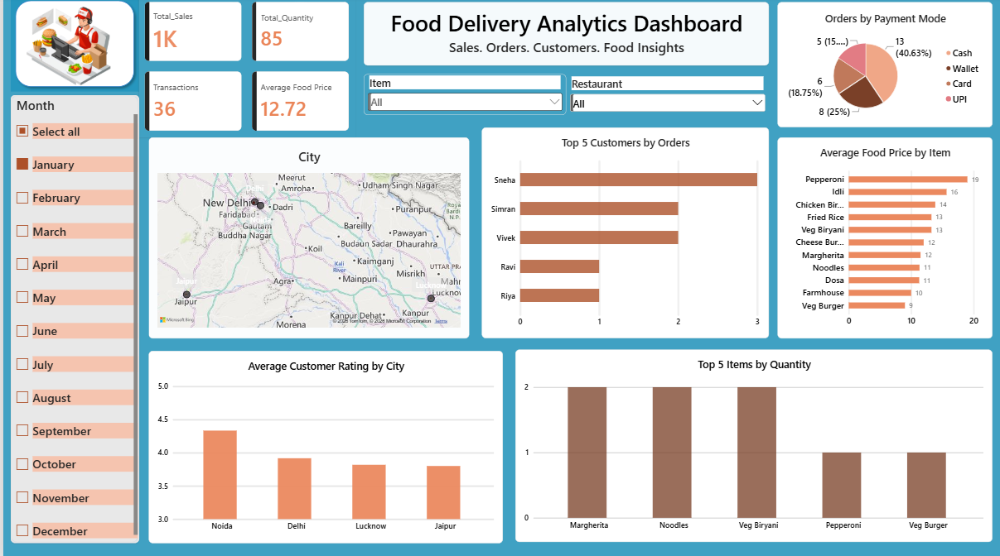

# Food Delivery Analytics Dashboard

## 📊 Project Overview

An interactive Food Delivery Analytics Dashboard built using Power BI to analyze sales, orders, customers, food prices, ratings, and payment modes.

## 🛠️ Tools & Technologies

- Power BI
- DAX
- Power Query
- Data Modeling
- Excel

## 📌 Key KPIs

- Total Sales
- Total Quantity
- Total Transactions
- Average Food Price

## 📈 Dashboard Insights

- Top 5 customers by number of orders
- Top 5 items by quantity
- Average food price by item
- Average customer rating by city
- Orders by payment mode
- City-wise analysis

## 🖼️ Dashboard Preview

## 📁 Files

- .xlsx – Practice dataset
- .png – Dashboard preview
- .pbix – Power BI dashboard file
